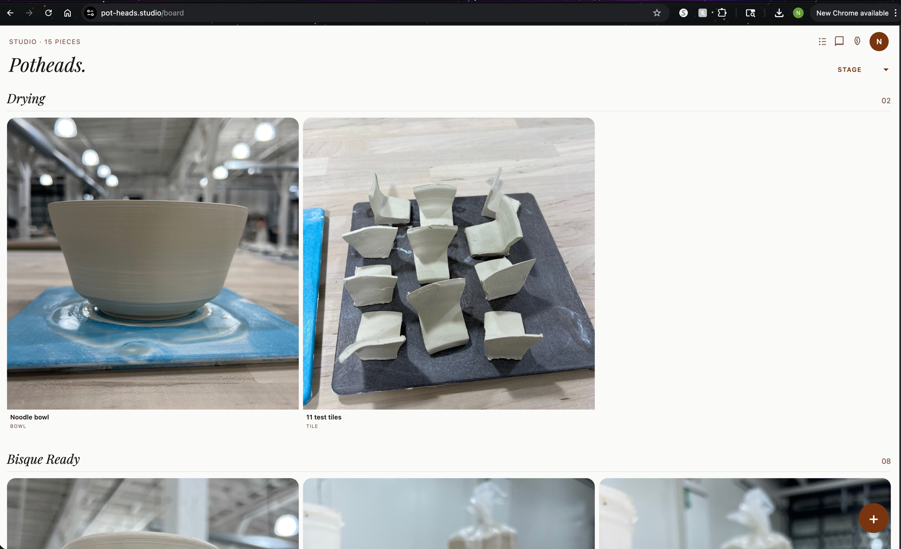
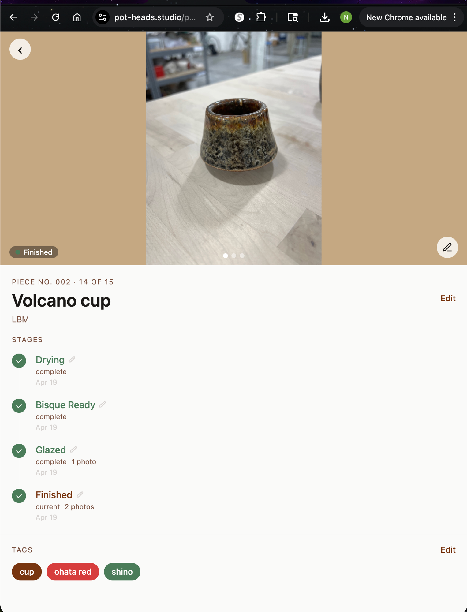

# Potheads

A mobile-first PWA for tracking pottery pieces through the production process — from the wheel to the kiln and beyond.

**Live app:** https://pot-heads.studio





---

## What it does

Pottery takes weeks. A piece gets thrown, left to dry, trimmed, fired in a bisque kiln, glazed, fired again, and finally comes home — or gets lost along the way. Potheads keeps track of where every piece is in that journey.

- **Stage tracking** — pieces move through Drying → Bisque Ready → Glazed → Finished (or Lost)
- **Photo log** — attach photos at any stage; view as a carousel or lightbox
- **Tags** — label pieces by form (bowl, mug, vase…) and glaze (celadon, shino…)
- **Private by default** — each user sees only their own pieces via row-level security

---

## Tech stack

| Layer | Choice |
|-------|--------|
| Frontend | React 19 + Vite |
| Styles | Tailwind CSS v4 |
| Backend / Auth | Supabase (Postgres, Storage, Google OAuth) |
| PWA | vite-plugin-pwa |
| Hosting | Vercel |

---

## Pottery workflow

```
Thrown
  └─► Drying          (freshly thrown, waiting to be trimmed)
        └─► Bisque Ready  (trimmed + dry, left at studio for kiln)
              └─► Glazed      (returned from bisque, glaze applied)
                    └─► Finished   (out of the glaze kiln — done!)
                    └─► Lost       (cracked, exploded, or kiln casualty)
```

The user doesn't manage the kiln. Pieces sit at **Bisque Ready** until the studio fires them.

---

## Key features

- **Board view** — pieces grouped by stage, with thumbnail photos and tag chips
- **Detail view** — hero photo carousel, stage timeline, tag editor, advance-stage button
- **Add piece flow** — tap +, take a photo, name it, pick a clay body — saved instantly
- **Image compression** — photos compressed in-browser before upload (max 1600px)
- **Lost pieces** — soft-deleted; hidden from board, never hard-deleted
- **iOS PWA** — designed for "Add to Home Screen" on iPhone (390px base width)

---

## Database schema

| Table | Purpose |
|-------|---------|
| `pieces` | Core piece record (name, clay body, current stage, owner) |
| `stage_events` | Audit log of every stage transition with optional photo + note |
| `photos` | Photo metadata; files stored in Supabase Storage |
| `tags` | Tag definitions (name, category) |
| `piece_tags` | Many-to-many join |

Storage bucket: `photos` (private), path: `{user_id}/{piece_id}/{timestamp}.jpg`

---

## Local development

```bash
# Install deps (legacy-peer-deps required for vite-plugin-pwa)
npm install

# Set env vars
cp .env.example .env.local
# Fill in VITE_SUPABASE_URL and VITE_SUPABASE_ANON_KEY

# Start dev server
npm run dev
```

Auth redirects are hard-coded to the production Vercel URL, so Google OAuth won't complete in local dev without updating `redirectTo` in `src/lib/supabase.js`.

---

## Project structure

```
src/
  lib/
    supabase.js        — Supabase client
    pieces.js          — pieces CRUD + stage progression
    photos.js          — upload, signed URL cache, batch fetch
    tags.js            — tags CRUD + batch fetch
    useTagColors.js    — tag color hook
  pages/
    Login.jsx          — Google OAuth sign-in screen
    Board.jsx          — main board (pieces by stage)
    PieceDetail.jsx    — piece detail, photos, tags, stage history
  components/
    AddPiece.jsx           — new piece bottom sheet
    StageColumn.jsx        — stage group + card grid
    TagChip.jsx            — colored tag pill
    BottomSheet.jsx        — reusable mobile modal
    PotteryPlaceholder.jsx — SVG fallback when no photos
  App.jsx              — router + auth guard
  main.jsx             — entry point
```

---

## Design notes

- Mobile-first, 390px (iPhone 14) as the base width
- Tailwind v4 custom tokens: `bg-clay`, `bg-tan`, `bg-stage-complete`, `font-display`
- No TypeScript — plain JavaScript throughout
- Camera input via `<input type="file" capture="environment">` (not getUserMedia — unreliable in iOS PWA)
- SVG placeholder illustrations for 8 pottery forms: bowl, mug, cup, vase, plate, pitcher, teapot, planter
